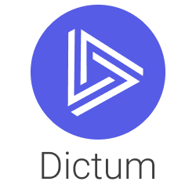

<p align="center">

</p>

<p align="center">


</p>

__[Documentation](https://discover-labs.github.io/dictum/)__

__[Example Project](https://github.com/discover-labs/dictum/tree/master/dictum/dictum/examples/chinook)__

Dictum is a __Business Intelligence framework__ written in Python. It includes a
general-purpose __metrics engine__ and allows your organization to have a __shared__,
__version-controlled__ and __well-documented__ understanding of what the important
metrics are and how they are computed from the source data.

<p align="center">

</p>

The main features are:

- 🧑‍🔧 **A structured way to describe your metrics.** Metrics are defined in simple, readable YAML files. [👉 Learn how to get started with your own project](https://discover-labs.github.io/dictum/concepts/project/)
- 🪄 **Interactive analytics in Jupyter.** Slice and dice your metrics quickly and easily. Get the data as a Pandas DataFrame. [👉 Learn how to query Dictum](https://discover-labs.github.io/dictum/concepts/query/ql/)
- 🤩 **Dataviz powered by Altair.** Quickly build visualizations based on your metric data. [👉 Demo Jupyter notebook](https://discover-labs.github.io/dictum/concepts/query/altair/)
- 😎 **SQL-like expression language.** Write metric expressions in the familiar SQL syntax.
- 🦥 **Reusable expressions.** Define metrics using other previously-defined metrics.
- 🐇 **Automatic multi-hop joins.** You define foreign keys for tables, Dictum writes boring boilerplate SQL for you.
- 🤖 **Python API**. Build data applications powered by your Dictum project.

🚂 Supported backends:

- [SQLite](https://discover-labs.github.io/dictum/concepts/backend/#sqlite-built-in)
- [Postgres](https://discover-labs.github.io/dictum/concepts/backend/#postgres)
- [Vertica](https://discover-labs.github.io/dictum/concepts/backend/#vertica)
- Snowflake, BigQuery, DuckDB and more coming soon.

Example [Metric](https://discover-labs.github.io/dictum/concepts/model/metric/) definition:

```yaml
# metrics/revenue.yml
name: Revenue
description: |
  Sum of all order amounts excluding
  bonus currency spending.
table: orders
expr: sum(amount - coalesce(bonus_spent, 0))
format:
  kind: currency
  currency: USD
```

Example [Table](https://discover-labs.github.io/dictum/concepts/model/table/) Definition:

```yaml
# tables/orders.yml
source:
  schema: marts
  table: orders

related:
  user: user_id -> users.id
  product: project_id -> products.id
```

# Installation

Install from PyPi:

```sh
pip install dictum
```

# Basic usage

[Learn how to query the example project](https://discover-labs.github.io/dictum/concepts/query/ql/)
