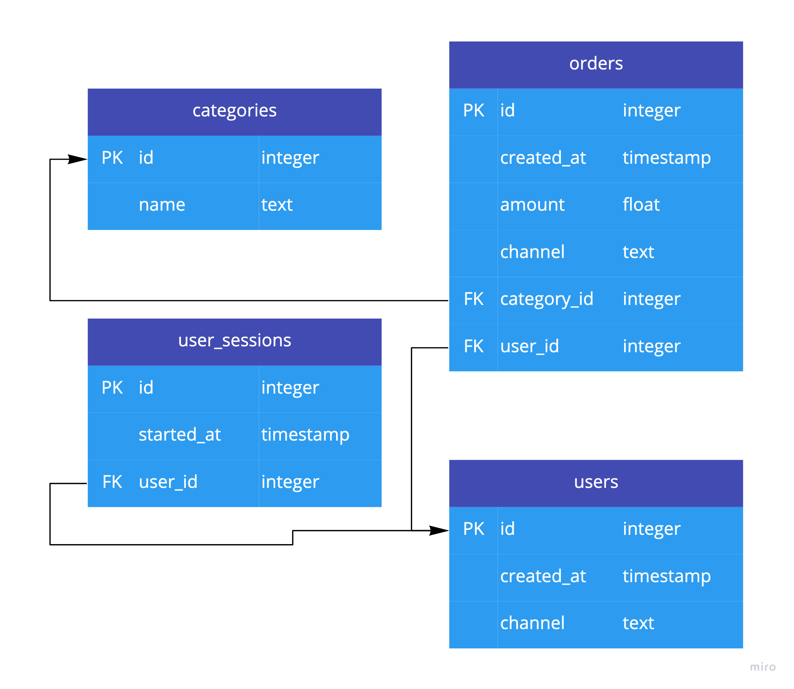

# Tables and Measures

The most important entity in your data model is a __table__. Almost everything in the model
revolves around tables. You can think of a table as a table in a relational database
(although it's not limited to that) or a data frame. Basically, it's a collection of
same-length labeled and typed columns.

Each table has one or more __foreign keys__ — columns that link rows in this table to
some other entity.

For example, in an `orders` table you can have a `user_id` column, which is an identifier
of a user who made this particular order. And users are stored in a `users` table, which
has a unique identifier (__primary key__): the `id` column. So to find a user who made
an order, you take the `user_id` of that order and find a row in the `users` table that
has an `id` equal to that.


## Look at your data first

Before doing anything, it's good to look at your database and relationships between the
tables.

<figure markdown>
  
  <figcaption>Example database structure</figcaption>
</figure>

As you can see, there are only four tables. Each table has an `id` primary key.

The most interesting table, `orders`, contains order amounts, time when the order was
created, link to the user, category and a marketing channel that this order was
attributed to.

The `users` table contains users, with just one meaningful attribute: the timestamp of
when the user signed up (`created_at`).

The `user_sessions` table contains information about user activity — when a session
started and which user it was.

`categories` is just a mapping of order category identifier to human-readable names.


## Define a measure

Remember that `project.yml` file? Let's edit it.

```{ .yaml title=project.yml hl_lines="5 6 7 8" }
--8<-- "snippets/first_model/first_measure.yml"
```

We define our tables under a `tables` key. The first table we define is called "orders".
This is an internal name, so you can name your tables anything — think of a variable
name in a programming language or an SQL alias.

Each table must have a `source` — in our case this is the name of the actual database
table. This is a string that will tell your backend where this table is stored.

!!! info

    A primary key is a column that uniquely identifies rows in this table.

    `primary_key` field is not required, but it's a good practice to add them if applicable.
    Without this field a table can't be a target of a relationship.

```{ .yaml title=project.yml hl_lines="9 10 11 12 13" }
--8<-- "snippets/first_model/first_measure.yml"
```

Then, under `measures`, we define which aggregations are applicable to this table.

`revenue` key is the same as `orders` — it's a unique name that you choose. It will be
used behind the scenes for querying the server and in the Python API, so give it a
meaningful name, but don't worry too much about it.

The `name` and `expr` fields are required for a measure. `description` is optional, but
it's a good practice to write exhaustive descriptions.

`expr` is the most importand field. It's an expression that will calculate what you want.
Expressions are written in a special
[SQL-like expression language](../reference/expression_language.md).
Measure expressions are always aggregate, meaning that they use aggregate functions like
`sum`, `avg`, `min`, `max` etc.

For revenue, the expression is `sum(amount)`. It means that to calculate `revenue`, we
need to calculate the sum of `amount` column on current table (`orders`). If you think
about it, it makes sense: revenue is just the sum of order amounts.

!!! info
    You might have noticed that we talked about _metrics_ in the introduction, but here we're
    defining _measures_. There is a subtle difference between measures and metrics, but
    all measures are automatically promoted to metrics by default. So, for the time being,
    you can think of them as the same thing.

Now you can query your store in the web interface:

```sql
select revenue
```

This should give you a single number — total revenue from the `orders` table.
